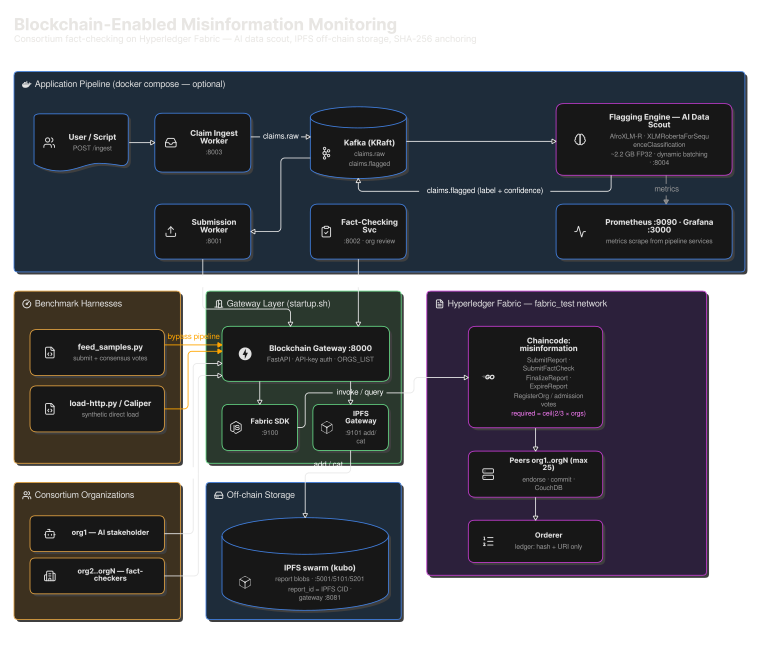

# A Blockchain Enabled Framework For Misinformation Monitoring

Consortium blockchain framework for monitoring misinformation: a Hyperledger
Fabric network anchors only a SHA-256 hash + off-chain URI of each report on the
ledger, while the full report object (including raw text) lives off-chain in
IPFS (SQLite fallback). A FastAPI gateway authenticates orgs by API key and signs
on their behalf.

## How it works

- **On-chain** (Go chaincode): hash + `off_chain_uri` + metadata only. Never raw text.
- **Off-chain**: full report in IPFS (content-addressed; the CID doubles as the
  report id), SQLite fallback.
- **Gateway** (`:8000`): the only thing users/orgs talk to. API-key auth
  (`X-API-Key` header). Ledger access goes through the **official Fabric
  Gateway SDK** (`@hyperledger/fabric-gateway`) via a small Node.js sidecar on
  `:9100`; falls back to the `peer` CLI bridge when the sidecar is down
  (`FABRIC_BACKEND=auto|gateway|cli`).
- **Explorer** (`:8080`): network visualizer over the `fabric_test` network.
- **One command runs the whole pipeline**: `./startup.sh` deploys the network,
  onboards org3 with a 2-of-3 endorsement policy, registers stakeholder orgs on
  the ledger, drives a load phase through the gateway, and (by default) runs the
  Caliper benchmark (`load-http.py` then `run-caliper.sh`). Run `scripts/run_benchmarks.sh` for parameter sweeps varying samples and org count.

## Architecture



## Repository layout

```
.
├── startup.sh                    # single entry point: deploy + load + hints
├── benchmarks/
│   ├── load-http.py              # synthetic load driver -> gateway
│   ├── caliper/                  # Hyperledger Caliper benchmark suite (official
│                                 #   Fabric Gateway binding; run-caliper.sh)
│   └── run_benchmarks.sh         # iterative benchmark runner varying samples/orgs
├── blockchain/
│   ├── scripts/                  # deploy.sh, onboard-org3.sh, register-orgs.sh,
│   │                             # add-orgs.sh, bootstrap-keys.sh,
│   │                             # gen-explorer-config.sh, start-ipfs.sh,
│   │                             # start-gateway-service.sh
│   ├── chaincode/misinformation/ # Go chaincode (go.mod + vendor/)
│   ├── fabric-samples/           # git-ignored runtime (PROVISIONS BELOW)
│   └── explorer/                 # Hyperledger Explorer UI compose + profile
├── apps/
│   ├── blockchain_gateway/app/v1-0-0/
│   │   ├── api/                  # FastAPI gateway (server.py, storage.py)
│   │   └── src/                  # blockchain.py (FabricGatewayBridge /
│   │                             #   FabricBridge), report.py ...
│   ├── ipfs_gateway/              # generic IPFS add/cat bridge over kubo,
│   │                             #   independently reachable (:9101)
│   └── fabric_gateway/           # Node.js sidecar wrapping the official
│                                   #   @hyperledger/fabric-gateway SDK (:9100)
└── summary.txt                   # full execution trace + code reference map
```

> Git-ignored runtime you must provision once (see below): the Python
> virtualenv, `blockchain/fabric-samples/` (Fabric binaries + test network),
> and `apps/blockchain_gateway/app/v1-0-0/api/offchain.db` (API keys).

## Prerequisites

### System packages

| Tool | Why | Check |
|---|---|---|
| **Docker + Compose v2** | Runs peers/orderers/CouchDB/IPFS/Explorer | `docker compose version` |
| **Python 3.10+** | Gateway + `bootstrap-keys.sh` seed script | `python3 --version` |
| **Go 1.22+** | Chaincode vendoring during deploy (tested with 1.24.0) | `go version` |
| **`curl`** | Pre-flight / verification | `curl --version` |
| **`jq`** | Chaincode lifecycle tooling | `jq --version` |
| **`git`** | Clone (this repo used during setup) | `git --version` |

Docker images (`hyperledger/fabric-peer`, `hyperledger/fabric-orderer`,
`hyperledger/fabric-ca`, `hyperledger/fabric-tools`, `hyperledger/fabric-ccenv`,
`couchdb`, `ipfs/kubo`, `hyperledger/explorer`, `hyperledger/explorer-db`) are
pulled automatically by the scripts on first run — no manual `docker pull`
needed.

> **WARNING — Compose version:** use the modern Compose **v2** plugin. Legacy
> `docker-compose` v1.29.2 breaks the test network (containers come up with zero
> peers while the script reports success). If you see the symptom, remove the
> stale `fabric_test` docker network and re-run startup.

## Platform compatibility

The **hosting/deployment stack is Linux-first**: the Fabric CLI orchestration
(`peer`, `cryptogen`, `configtxgen`, ... under `blockchain/fabric-samples/bin/`)
are **Linux x86-64 ELF binaries** driven by bash scripts (`startup.sh`, all of
`blockchain/scripts/*.sh`). They cannot execute directly on a native Windows or
macOS host.

| Platform | Hosting the network | As an HTTP client |
|---|---|---|
| **Linux** | ✅ fully supported (bare metal, VM, or container) | ✅ |
| **Windows** | ✅ via **WSL2** (run the Linux scripts inside WSL); not natively | ✅ |
| **macOS** | ⚠️ via a Linux VM (UTM / Lima / Colima / Docker Desktop backend); Apple Silicon cannot run the Linux ELF CLIs on the host | ✅ |

Windows and macOS work fine as **HTTP clients** against a Linux-hosted gateway
— no local installation is needed; just call `:8000` with your `X-API-Key`.

### 1. Clone the repo (once)

```bash
git clone <your-repo-url> A_Blockchain_Enabled_Framework_for_Misinformation_Monitoring
cd A_Blockchain_Enabled_Framework_for_Misinformation_Monitoring
```

### 2. Provision `blockchain/fabric-samples/` (one-time)

`deploy.sh`, the gateway bridge and the Explorer profile all expect the Fabric
test network and CLI binaries under `blockchain/fabric-samples/`:

- `bin/`   — Fabric CLI binaries: `peer`, `orderer`, `configtxgen`,
  `cryptogen`, `configtxlator`, `fabric-ca-*`, `osnadmin`, `discover`,
  `ledgerutil`
- `config/` — CLI config (core.yaml, orderer.yaml, configtx.yaml dir)
- `test-network/` — the fabric-samples test network (`network.sh`, `addOrg3/`,
  `scripts/`, `organizations/`, compose files)

Get a fabric-samples 2.5.x tree and the matching binaries, then place them here:

```bash
cd blockchain/fabric-samples
curl -sSL https://raw.githubusercontent.com/hyperledger/fabric/main/scripts/bootstrap.sh \
  | bash -s -- 2.5.9 1.5.9
# bootstrap.sh leaves: ./fabric-samples (repo clone), ./bin, ./config
mv fabric-samples/test-network .
rm -rf fabric-samples
# Result required:
#   blockchain/fabric-samples/{bin,config,test-network}
```

> The chaincode Go modules are vendored in `blockchain/chaincode/misinformation/go/vendor/`,
> so no `go mod download` is needed.

### 3. Create the Python virtualenv (one-time)

```bash
python3 -m venv venv_A_Blockchain_Enabled_Framework_for_Misinformation_Monitoring
venv_A_Blockchain_Enabled_Framework_for_Misinformation_Monitoring/bin/pip install \
  -r apps/blockchain_gateway/app/v1-0-0/api/requirements.txt
```

### 4. Mint API keys (one-time per clean clone)

The gateway authenticates every request against a SQLite table. The bootstrap
script writes keys for org1/org2/org3 plus `stress-key` (used by the load
driver) directly into `offchain.db`, breaking the chicken-and-egg of key-via-API:

```bash
blockchain/scripts/bootstrap-keys.sh org1 org2 org3
```

## Run it end to end

**The short version:** `./startup.sh --orgs 3 --samples 50` now does Steps 1, 1b, 2,
2b, and API-key bootstrapping for you automatically, every run (all idempotent —
safe to re-run any time). The step-by-step breakdown below is what it's actually
doing internally, useful for running/debugging one piece at a time, or just
understanding the pieces. Application-pipeline services (Kafka, flagging-engine,
submission-worker, fact-checking-service, monitoring) are separate — bring those
up with `docker compose up -d --build` (see `docker-compose.yml`) once the
blockchain layer from `./startup.sh` is up.

Run the following **from the repo root** each time you start a session.

### Step 1 — Off-chain content store (IPFS)

```bash
blockchain/scripts/start-ipfs.sh        # starts kubo in the "ipfs-node" container
```

Ready when it prints `IPFS ready: http://localhost:5001`.

### Step 1b — IPFS Gateway (read/write bridge)

```bash
blockchain/scripts/start-ipfs-gateway.sh   # generic add/cat bridge over kubo, on :9101
```

A thin, independently-reachable HTTP bridge in front of kubo (`apps/ipfs_gateway`) —
`blockchain_gateway` talks to it instead of kubo directly, the same relationship
`blockchain_gateway` has with the Fabric Gateway SDK sidecar (Step 2b). Any other
downstream consumer that just needs to fetch a report by CID can also call
`GET :9101/cat/{cid}` directly, without going through `blockchain_gateway`'s
API-key-authenticated endpoints at all — the CID itself is the access grant,
same trust model any public IPFS gateway uses.

### Step 2 — API gateway

```bash
blockchain/scripts/start-blockchain-gateway.sh   # builds + starts, waits for health, on :8000
```

Runs `FABRIC_BACKEND=gateway` (requires Step 2b below to already be up) and reads/writes
API keys in the same `offchain.db` `bootstrap-keys.sh` writes to (bind-mounted, not copied
into the image), so bootstrapping keys before or after starting it both work.

<details>
<summary>Alternative: run it directly on the host (needed for the legacy <code>peer</code> CLI fallback path)</summary>

```bash
export PATH="$PWD/blockchain/fabric-samples/bin:$PATH"   # gateway shells out to `peer`
venv_A_Blockchain_Enabled_Framework_for_Misinformation_Monitoring/bin/uvicorn \
  --app-dir apps/blockchain_gateway/app/v1-0-0/api/ server:app --host 0.0.0.0 --port 8000
```

The Docker image deliberately doesn't bundle Fabric's `peer` binary, so it only ever uses
the SDK sidecar (Step 2b). Run it this way instead if you need `FABRIC_BACKEND=auto`'s
fallback to the `peer` CLI when the sidecar is down.
</details>

Sanity check (needs keys from step 4):

```bash
curl -s -H "X-API-Key: stress-key" http://localhost:8000/api/status
# -> {"backend":"ipfs","ipfs_available":true,...}
```

### Step 2b — Official Fabric Gateway SDK service (optional but recommended)

The API prefers the official `@hyperledger/fabric-gateway` SDK over the legacy
`peer` CLI. The SDK runs in a small Node.js sidecar that joins the `fabric_test`
docker network (so discovered peer hostnames resolve natively — same trick as
the Explorer):

```bash
blockchain/scripts/start-gateway-service.sh     # build + start + health check
```

With the sidecar up, the gateway logs `[bridge] using official Fabric Gateway
SDK service at http://localhost:9100`. Transport selection is controlled by
`FABRIC_BACKEND` on the uvicorn process: `auto` (default; sidecar if healthy,
else CLI), `gateway` (require sidecar), `cli` (always peer CLI). No change is
needed when running behind `./startup.sh`.

### Step 3 — Deploy network + chaincode + load (the whole pipeline)

```bash
./startup.sh --orgs 3 --samples 50
```

`startup.sh` runs:

1. `blockchain/scripts/deploy.sh` — resets any old network, brings up the Fabric
   test network (`mychannel`, chaincode `misinformation` v2.1), onboards **org3**
   via `addOrg3/addOrg3.sh up` + `onboard-org3.sh` (2-of-3 endorsement policy),
   adds extra orgs when `--orgs > 3`, registers stakeholder orgs 1..N on the
   ledger (`RegisterOrg`), and regenerates the Explorer connection profile.
2. **IPFS + IPFS Gateway** — `start-ipfs.sh` then `start-ipfs-gateway.sh`.
3. **API keys** — `bootstrap-keys.sh org1 org2 org3` (idempotent).
4. **Fabric Gateway SDK sidecar + blockchain gateway** — `start-gateway-service.sh`
   (force-recreated, since the sidecar's crypto material just changed) then
   `start-blockchain-gateway.sh`.
5. **Pre-flight** — asserts the gateway answers `200` on `/api/status`
   (aborts loudly if not), then **quick validation load** —
   `benchmarks/load-http.py` POSTs `--samples` synthetic reports through the
   gateway; each lands in IPFS and its hash + URI is anchored on the ledger.
6. **Caliper benchmark** (skip with `--skip-caliper`) — scales the official
   Hyperledger Caliper suite: regenerates the Fabric connection profile and
   benchmark config (writes=`N*10`, reads=`N*20`), then runs the benchmark
   suite inside Docker (`~60-90s`). Results land in `benchmarks/caliper/report.html`.

Explorer isn't started automatically — see Step 4 below if you want it.

`--orgs N` defaults to 3 (max 20); `--samples N` defaults to 50 (max 100000).
Use `./startup.sh --help` for the quick flag reference.

### Quick skip

```bash
# Run only load-http.py, skip Caliper
./startup.sh --orgs 3 --samples 50 --skip-caliper
```

### Step 4 — Hyperledger Explorer (network visualizer)

The deploy just regenerated `blockchain/explorer/connection-profile/networkConfig.json`,
so recreate the containers so Explorer picks it up:

```bash
docker compose -f blockchain/explorer/docker-compose.yaml down -v
docker compose -f blockchain/explorer/docker-compose.yaml up -d
```

UI: http://localhost:8080 — login `exploreradmin` / `exploreradminpw`.

### Step 5 — Verify tamper-evidence for a report CID

Grab any CID from the load phase, then check the on-chain/off-chain link:

```bash
curl -s -H "X-API-Key: stress-key" http://localhost:8000/api/reports           # list, first report_id is a CID
CID=<paste-your-report_id-here>
curl -s -H "X-API-Key: stress-key" "http://localhost:8000/api/reports/$CID"     # full report from IPFS
curl -s -H "X-API-Key: stress-key" "http://localhost:8000/api/reports/$CID/verify"
```

`/verify` recomputes the off-chain content hash and compares it to the hash
committed on the ledger. Expected close-out:

```json
{"report_id":"Qm...","off_chain_intact":true,"matches_on_chain":true,"verified":true,"explanation":"The off-chain copy is unmodified AND its hash matches the immutable, consortium-voted hash stored on the ledger."}
```

> The `/verify` endpoint previously returned HTTP 500 because the on-chain query
> result arrives as an ASCII-encoded string rather than a dict. This was fixed in
> `apps/blockchain_gateway/app/v1-0-0/api/server.py` via the `_on_chain_record()` helper.

## Benchmarking

The pipeline now runs **both** a quick HTTP load test and the Caliper benchmark
suite by default. This validates gateway connectivity before the more expensive
Caliper run. An iterative runner is provided in `scripts/run_benchmarks.sh` for
varying samples and org count with automatic network efficiency (skips redeploy
when org count unchanged).

### Default flow (`./startup.sh --orgs 3 --samples 50`)

| Step | Command | Purpose | Approx. time |
|------|---------|---------|--------------|
| 3a | `load-http.py` | Quick validation (POST `--samples` reports via gateway) | ~5s |
| 3b | `gen-caliper-config.sh --orgs 3 --samples 50` | Scale benchmark config (writes=N×10, reads=N×20) | <1s |
| 3c | `run-caliper.sh` | Full benchmark suite in Docker (500/1000 tx) | 60-90s |

**Results:** `benchmarks/caliper/report.html` (throughput/latency percentiles).

### Custom scaling

The `--samples N` argument controls both load-http request count and Caliper txNumbers:
- `load-http.py`: N requests
- Caliper: writes = N × 10, reads = N × 20 (e.g. `--samples 100` → 1000 writes @ 25 TPS / 2000 reads @ 50 TPS)

### Skip Caliper (load-http only)

```bash
./startup.sh --orgs 3 --samples 50 --skip-caliper
```

### Iterative benchmark runner

```bash
scripts/run_benchmarks.sh --start-samples 1 --end-samples 10 --start-orgs 3 --max-orgs 5 --incrementor 1
```

Configuration: samples 1~10 (step 1), orgs 3~5 (step 1). Output dir:
`/tmp/benchmarks/results/orgs_3/samples_1/`, etc. First org count full
deploy; subsequent org counts skip redeploy.

### Local model-evaluation results

Local (non-blockchain) model-evaluation spreadsheets live in
`results/local/` and are **git-untracked** by default (tracked/committed as
desired):

- `results/local/best.xlsx` — best-model evaluation summary
- `results/local/full.xlsx` — full evaluation results

## API quick reference

All endpoints require `-H "X-API-Key: <key>"` (keys from `bootstrap-keys.sh`;
`stress-key` → org1).

| Method & path | Purpose |
|---|---|
| `GET /api/status` | IPFS backend status |
| `POST /api/reports` | Submit a report (body: `report_id`, `language` nso/zul/eng, `label` 0/1, `confidence`, `model_version`, `raw_text`, ...) |
| `GET /api/reports` | List reports |
| `GET /api/reports/{id}` | Report + off-chain payload |
| `GET /api/reports/{id}/chain` | On-chain record (hash, uri, status, votes) |
| `GET /api/reports/{id}/verify` | Tamper-evidence check (off-chain vs on-chain hash) |
| `GET /api/reports/{id}/history` | Full tx/history trail via Fabric's native `GetHistoryForKey` — every version this claim's `off_chain_uri` has pointed to, oldest first |
| `POST /api/reports/{id}/vote` | Org vote on a report |
| `POST /api/reports/{id}/finalize` | Finalize a verdict (consortium quorum) |
| `POST /api/reports/{id}/expire` | Expire a report past its voting deadline |
| `POST /api/orgs/apply`, `/api/orgs/{msp}/admission`, `/vote`, `/finalize` | New-org admission workflow (pending after founding limit) |
| `GET /api/orgs`, `GET /api/orgs/{msp}/admission` | Registered orgs / admission status |

## Teardown

```bash
blockchain/scripts/deploy.sh down          # stop Fabric (as startup.sh [4/4] reminds you)
blockchain/scripts/start-ipfs.sh down      # stop IPFS container
blockchain/scripts/start-ipfs-gateway.sh down      # stop the IPFS Gateway bridge
blockchain/scripts/start-gateway-service.sh down   # stop the Gateway SDK sidecar
blockchain/scripts/start-blockchain-gateway.sh down   # stop the API gateway
# (or Ctrl-C if you ran it directly on the host instead)
docker compose -f blockchain/explorer/docker-compose.yaml down -v   # optional: stop Explorer
```

## Troubleshooting

| Symptom | Cause / fix |
|---|---|
| `ERROR: unknown flag` from `startup.sh` | Only `--orgs`, `--samples`, `--skip-caliper` and `--help` exist now. Re-check `./startup.sh --help`. |
| `ERROR: API gateway unreachable (HTTP 000)` | Gateway not running. Start it (Step 2) before running `startup.sh`. |
| Gateway returns `401` on `/api/status` | API keys never seeded (gateway started before Step 4) — run `blockchain/scripts/bootstrap-keys.sh org1 org2 org3` and restart the gateway. |
| `docker-compose` legacy v1 errors / peers vanish mid-deploy | Use Compose v2 (`docker compose`). Remove stale `fabric_test` docker network (`docker network rm fabric_test`) if blocked. |
| `x509: certificate signed by unknown authority` from onboard-org3 | `FABRIC_SAMPLES` not pointing at *this* repo's `blockchain/fabric-samples` (a stale `~/fabric-samples` gets picked up when the repo layout is wrong). `deploy.sh` exports it automatically — make sure fabric-samples is provisioned exactly per Step 2. |
| `peer` command not found in gateway error responses | `blockchain/fabric-samples/bin` must be on `PATH` when `uvicorn` starts (Step 2 exports it). |
| `RegisterOrg` / `SubmitReport` rejected: "not a registered stakeholder" | Registration is part of `deploy.sh` (`register-orgs.sh`), so run it via `./startup.sh` (Step 3) — don't hand-roll the network. |
| Explorer shows stale topology | The connection profile is regenerated every deploy. Recreate the containers per Step 4. |
| `"backend":"sqlite"` in `/api/status` | The kubo node isn't reachable on `:5001`. Start it (Step 1) and restart the gateway. |